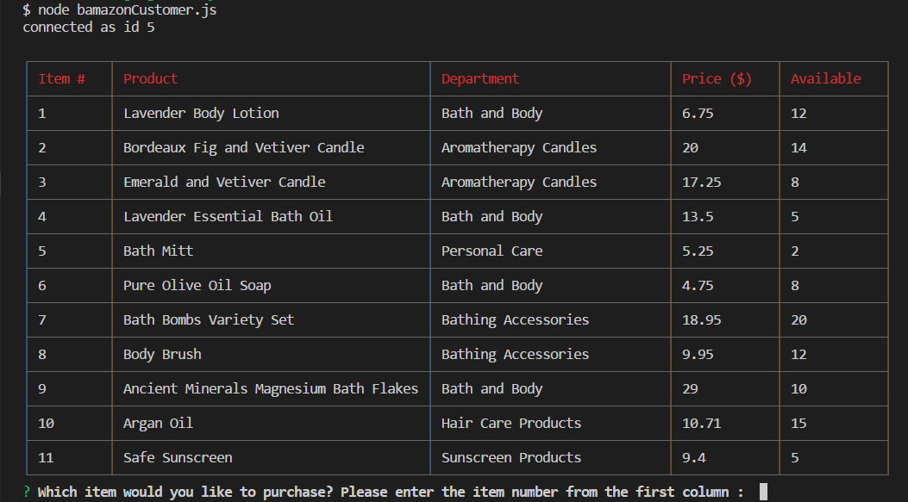
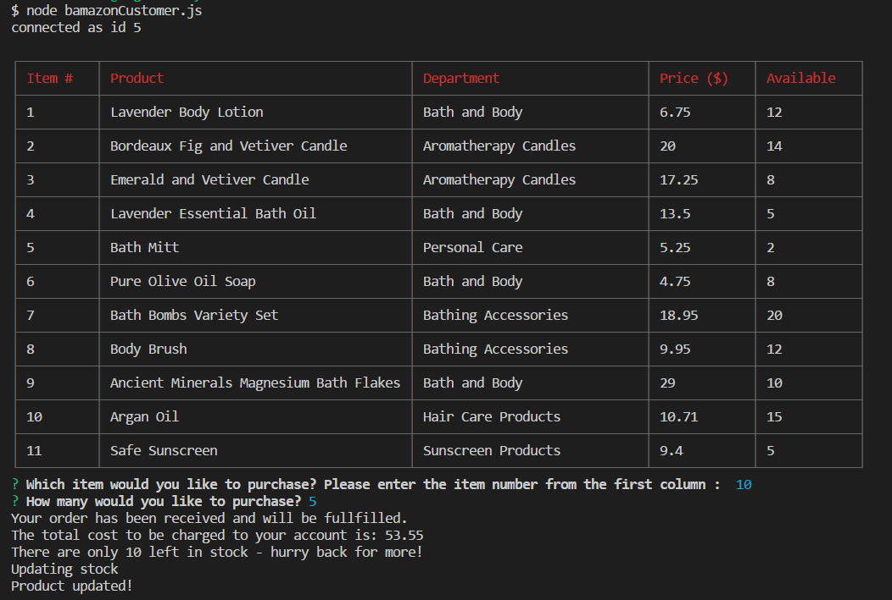
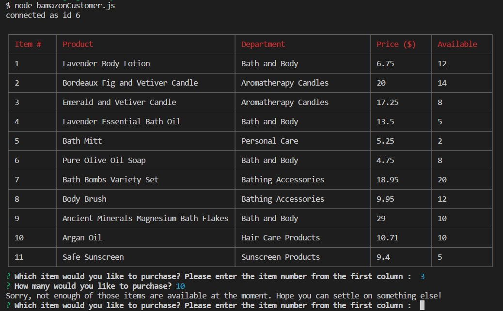

# bamazon

This is an Amazon-like storefront using MySQL skills. The app will take in orders from customers and deplete stock from the store's inventory. If you choose to clone the app, be sure to enter your own MySQL user name (user = "",) and password (password: "",) (see the image below). Also, be sure to run a "npm install" to download the neccessary npm package dependencies to successfully run the Command Line Application -- the app needs them for data input and storage. 

Once the npm packages are installed and the MySQL database has been created, type node bamazonCustomer.js in the terminal to display all of the items available for sale (see the image below). A prompt will ask for the ID of the product you would like to purchase. 

When you enter a valid item id to purchase, the application will ask how many you would like to buy. Entering a valid, in stock quantity, the app will generate a log response with the total price of the purchase and message stating that the stock has been updated in the SQL database (see below).

If you enter an invalid item to purchase, the application will not proceed. If you enter a quantity to purchase that is greater than what is in stock, the app will generate a log response that there are not enough of those items available and to choose another item to purchase (see below).

Enjoy the app! 

