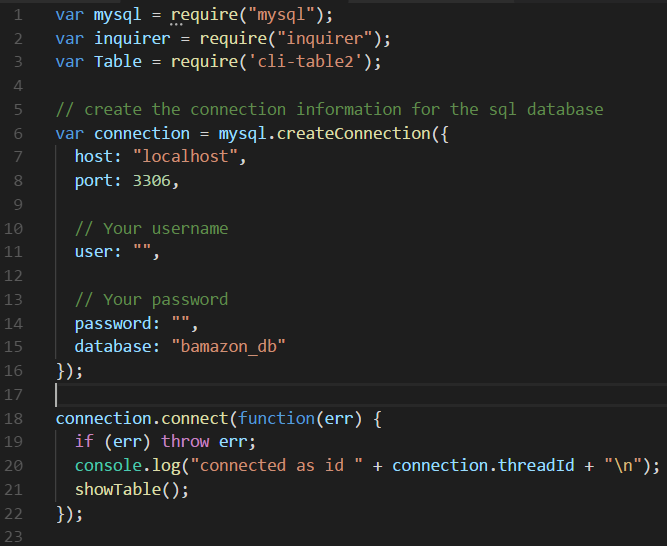

# bamazon

This is an Amazon-like storefront using MySQL skills. The app will take in orders from customers and deplete stock from the store's inventory. If you choose to clone the app, be sure to enter your own MySQL user name (user = "",) and password (password: "",) (see the image below). Also, be sure to run a "npm init" to download the neccessary. 

